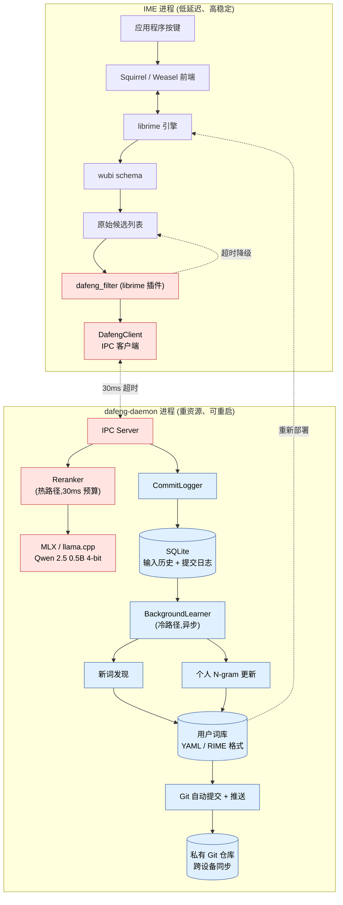

# 大风五笔 (Dafeng Wubi) — 设计文档

> **Phase 2 架构设计 · v0.2 · 2026-04**
> 一个跨平台、能学习、能预测的五笔输入法。
> 一切以"用户用得爽"为目标,工程上务实,不追求技术炫技。

---

## 1. 项目概览

| 项 | 值 |
|---|---|
| **项目名称** | 大风五笔 |
| **英文命名空间** | `dafeng` |
| **可执行名** | `dafeng-daemon` / `dafeng-cli` |
| **仓库名** | `dafeng-wubi` (主仓库) / `dafeng-userdata` (个人词库私有仓库) |
| **目标平台** | macOS (优先) / Windows |
| **核心语言** | C++17 (引擎与插件) / Swift (Mac 配置 UI 可选) / Python (训练辅助) |

### 核心目标

1. **跨平台一致体验** — Mac/Windows 双端,词库与学习数据通过 Git 同步
2. **传统五笔无损** — 保留盲打、四码定位、肌肉记忆,LLM 只是加分项
3. **本地智能学习** — 新词自动发现、个人用词自适应,数据不出本机
4. **严格性能预算** — 候选展示 < 100ms 硬约束,LLM 超时即降级

### 非目标 (Phase 2 内不做)

- 自研输入法引擎 (用 librime)
- 自研候选窗口 (用 Squirrel/Weasel)
- 云端推理 (隐私 + 延迟双重原因)
- 多人/多账号词库
- 配置 UI (后期可加,先用 YAML)

---

## 2. 架构设计

### 2.1 进程划分

采用**双进程**架构:

| 进程 | 职责 | 生命周期 |
|------|------|---------|
| **IME 进程** (Squirrel/Weasel + librime + `dafeng_filter`) | 处理按键、生成候选、UI 展示 | 跟随系统输入会话 |
| **dafeng-daemon** | LLM 推理、学习、新词发现、Git 同步 | 用户登录后常驻 |

**为什么必须分离?**
- IME 进程要极致稳定:LLM 加载/崩溃不能拖累输入
- 模型加载需要数秒:不能阻塞 IME 启动
- 资源隔离:daemon 出问题最差也是回退到普通 RIME 体验
- 跨平台抽象一致:两个平台的 daemon 代码可以高度共享

### 2.2 总体架构图



**图例**:🔴 热路径 (< 100ms 内必须完成) / 🔵 冷路径 (异步、可慢)

### 2.3 通信协议

| 平台 | 传输 | 路径 |
|------|------|------|
| macOS | Unix Domain Socket | `~/Library/Application Support/Dafeng/daemon.sock` |
| Windows | Named Pipe | `\\.\pipe\dafeng-daemon` |

**消息格式**:length-prefixed MessagePack
- 4 字节 big-endian length header + payload
- 单个请求 < 4KB,典型 < 1KB

**协议设计原则**:
- 所有请求带 `request_id`,支持乱序响应
- 客户端可设置每请求超时
- daemon 重启不影响 IME(自动重连,旧请求丢弃)

---

## 3. 性能预算

100ms 硬约束的拆解:

| 阶段 | 预算 (P50) | 上限 (P99) | 说明 |
|------|-----------|-----------|------|
| 按键 → librime | ~2 ms | 5 ms | 系统调度 |
| librime 码表查询 + 分词 | 5–10 ms | 15 ms | 已优化,无压缩空间 |
| dafeng_filter 准备请求 | <1 ms | 2 ms | |
| IPC 往返 | 2–5 ms | 10 ms | 同机进程间 |
| **LLM 推理** | **20–40 ms** | **30 ms (硬切)** | **核心控制点** |
| 候选重排 | <1 ms | 2 ms | |
| UI 渲染 | 10–20 ms | 30 ms | RIME 控制 |
| **总计** | **~50–80 ms** | **<100 ms** | 留 20% 余量 |

### 3.1 LLM 超时降级策略

```
t=0    : librime 产出 N 个原始候选
t=0    : dafeng_filter 立即向 daemon 派发请求 (非阻塞)
t=0~30 : 等待 daemon 响应
  ├─ 收到响应 → 用 LLM 排序,提交给 UI
  └─ 30ms 超时 → 用原始排序,提交给 UI,记录 miss
t=>30  : 即使 daemon 后到达响应也丢弃
```

**关键不变量**:`dafeng_filter` **永远不让用户等待超过 30ms**。

### 3.2 资源预算

| 资源 | IME 进程 | dafeng-daemon | 说明 |
|------|---------|--------------|------|
| 内存 (空闲) | +5 MB | ~150 MB | daemon 含模型 |
| 内存 (推理) | +5 MB | ~400 MB | 4-bit 量化模型驻留 |
| CPU (空闲) | ~0% | ~0% | |
| CPU (推理) | ~0% | M2 ~30% / 1 核 | 持续 30ms |
| 磁盘 | <1 MB | ~500 MB | 模型 + 用户数据 |

---

## 4. 核心模块

### 4.1 `dafeng_filter` (librime 插件)

**位置**:作为 librime 的 `Filter` 子类,挂在 wubi schema 的 `engine/filters` 里。

**职责**:
1. 接收 librime 标准翻译产生的候选列表
2. 调用 `DafengClient` 异步发起重排请求
3. 在超时窗口内等待响应
4. 输出最终排序的 Translation

**配置 (wubi.schema.yaml)**:
```yaml
engine:
  filters:
    - simplifier
    - uniquifier
    - lua_filter@*dafeng_filter_options

dafeng_filter_options:
  enabled: true
  timeout_ms: 30
  max_candidates_to_rerank: 10
  context_chars: 20
  fallback_silent: true
```

**早期实现路径**:
- 先用 Lua filter (librime 内置 Lua) 快速迭代
- 性能瓶颈在 LLM 而非过滤器本身,Lua 完全够用
- 后期若有需要再下沉到 C++,接口几乎不变

### 4.2 `dafeng-daemon` (主服务进程)

**进程结构**:
```
dafeng-daemon (主线程: 事件循环)
├─ IPC Server 线程        - 接收/响应 IPC
├─ Inference Worker 池    - 1-2 个,跑 MLX/llama.cpp
├─ Learning Worker        - 1 个,后台学习,低优先级
└─ Git Sync Worker        - 1 个,定时拉取/推送
```

**启动方式**:
- macOS: `launchd` LaunchAgent (用户级)
- Windows: 计划任务 / 启动项

### 4.3 Reranker (热路径推理)

**输入**:
```cpp
struct RerankRequest {
  std::string code;                      // 当前编码,如 "ggll"
  std::string context_before;            // 光标前 N 字
  std::vector<std::string> candidates;   // librime 原始候选
  std::string app_id;                    // 应用上下文(可选)
};
```

**输出**:
```cpp
struct RerankResponse {
  std::vector<int> reordered_indices;    // 输入的一个排列
  std::vector<float> scores;             // 各候选 logit (可选)
  uint32_t latency_us;                   // 实际耗时
  uint8_t model_version;                 // 用于调试
};
```

**推理实现**:
- 模型:Qwen 2.5 0.5B Instruct, 4-bit AWQ 量化
- **关键技巧**:用**单次前向传播 + logit 提取**而非生成,把每个候选作为 next-token 候选评分。延迟比生成低一个数量级。

### 4.4 BackgroundLearner (冷路径学习)

**触发时机**:
- 系统空闲 5 分钟后
- 累计 100 次提交后
- 每天定时一次

**任务**:
1. **N-gram 更新**:扫描最近输入历史,更新个人 bigram/trigram 频率
2. **新词发现**:
   - 找出"高频被分次输入但实际是同一短语"的序列
   - 用稍大模型(Qwen 1.5B)判断该短语合理性
   - 加入用户词库
3. **候选位置稳定性检查**:确保高频词位置不漂移

**输出**:更新 `~/Library/Application Support/Dafeng/userdata/wubi.userdb.yaml`,触发 RIME 重新部署。

### 4.5 存储层

```
~/Library/Application Support/Dafeng/    # Mac
%APPDATA%\Dafeng\                        # Windows
├── daemon.sock / pipe
├── models/
│   ├── qwen2.5-0.5b-q4.mlx              # 推理模型
│   └── qwen2.5-1.5b-q4.mlx              # 学习模型(可选)
├── history.db                           # SQLite,输入历史
├── userdata/                            # ← Git 同步的内容
│   ├── wubi.userdb.yaml                 # RIME 用户词库
│   ├── personal_ngram.bin               # 个人 N-gram
│   ├── learned_words.yaml               # 新发现的词
│   └── config.yaml                      # 用户设置
└── logs/
    ├── miss.log                         # 超时降级记录
    └── daemon.log
```

**Git 同步**:
- `userdata/` 是一个独立的 Git 仓库
- daemon 内置 libgit2,实现自动 commit & push
- 冲突时:本地优先 + 用户手动解决(罕见)
- `history.db` **永远不入 Git**(隐私)

---

## 5. 关键接口 (C++)

### 5.1 IPC 客户端

```cpp
// include/dafeng/client.h
namespace dafeng {

struct RerankRequest {
  std::string code;
  std::string context_before;
  std::vector<std::string> candidates;
  std::string app_id;
};

struct RerankResponse {
  std::vector<int> reordered_indices;
  std::vector<float> scores;
  uint32_t latency_us;
};

class DafengClient {
 public:
  static DafengClient& Instance();

  // 阻塞式调用,带超时。超时返回 std::nullopt。
  // 内部保证不抛异常,失败时返回 nullopt。
  std::optional<RerankResponse> Rerank(
      const RerankRequest& req,
      std::chrono::milliseconds timeout);

  // 异步上报提交事件(fire-and-forget)
  void RecordCommit(const std::string& code,
                    const std::string& committed_text,
                    const std::string& context_before);

  bool IsConnected() const;

 private:
  DafengClient();
  class Impl;
  std::unique_ptr<Impl> impl_;
};

}  // namespace dafeng
```

### 5.2 librime 插件入口

```cpp
// src/dafeng_filter.cc
#include <rime/filter.h>
#include "dafeng/client.h"

class DafengFilter : public rime::Filter {
 public:
  explicit DafengFilter(const rime::Ticket& ticket);

  rime::an<rime::Translation> Apply(
      rime::an<rime::Translation> translation,
      rime::CandidateList* candidates) override;

 private:
  bool enabled_;
  int timeout_ms_;
  int max_rerank_;
  int context_chars_;
};

RIME_REGISTER_PLUGIN(DafengFilter, "dafeng_filter");
```

### 5.3 Daemon 服务接口 (内部)

```cpp
// src/daemon/services.h
namespace dafeng {

class IRerankService {
 public:
  virtual ~IRerankService() = default;
  virtual RerankResponse Rerank(const RerankRequest& req) = 0;
  virtual bool IsReady() const = 0;
};

class ILearningService {
 public:
  virtual ~ILearningService() = default;
  virtual void RecordCommit(const CommitEvent& event) = 0;
  virtual void TriggerNewWordDiscovery() = 0;
  virtual void TriggerNGramUpdate() = 0;
};

// MLX 实现 (Mac)
std::unique_ptr<IRerankService> MakeMLXRerankService(
    const std::string& model_path,
    const RerankConfig& config);

// llama.cpp 实现 (Windows / 通用)
std::unique_ptr<IRerankService> MakeLlamaCppRerankService(
    const std::string& model_path,
    const RerankConfig& config);

}  // namespace dafeng
```

后端可插拔——首期重点在 Mac + MLX,Windows 后端通过抽象保留切换灵活性。

---

## 6. 数据流

### 6.1 单次按键的完整链路

```
1. 用户敲 'g'
2. 系统 → Squirrel → librime
3. librime 累积编码 = "g"
4. wubi schema 查询码表,产出候选 [感, 工, 一, ...]
5. dafeng_filter.Apply() 被调用
   ├─ a. 收集 context_before (从 commit_history 取最近 20 字)
   ├─ b. 构造 RerankRequest
   ├─ c. DafengClient.Rerank(req, 30ms)
   │     ├─ MessagePack 序列化
   │     ├─ 写入 socket
   │     ├─ 等待响应或超时
   │     └─ 反序列化响应
   ├─ d. 若有响应:按 reordered_indices 重排
   └─ e. 若超时:保持原序
6. 返回新 Translation 给 librime
7. librime → Squirrel → 候选窗口
8. 用户选词,提交 "感"
9. dafeng_filter (commit hook) → DafengClient.RecordCommit("g", "感", ctx)
   ├─ 异步发送给 daemon (fire-and-forget)
   └─ daemon 写入 history.db
10. (异步) BackgroundLearner 周期触发,分析历史
```

### 6.2 学习反馈环

```
用户每天打字
  ↓
history.db 累积 commits
  ↓ (每晚或空闲时)
BackgroundLearner 扫描
  ↓
发现新词候选 → 大模型验证 → learned_words.yaml
计算 N-gram     → personal_ngram.bin
  ↓
触发 RIME 重新部署 (热重载,无感知)
  ↓
下次输入,新词已经在候选里
  ↓ (定时)
Git commit & push
  ↓
另一台设备 git pull → 同样的体验
```

---

## 7. 模型选型

### 7.1 热路径模型 (Reranker)

| 候选 | 大小 (4-bit) | M2 延迟 (20 tokens 评分) | 中文质量 | 决策 |
|------|------------|------------------------|---------|------|
| Qwen 2.5 0.5B Instruct | ~400 MB | ~25 ms | ⭐⭐⭐⭐ | ✅ **首选** |
| Qwen 2.5 1.5B Instruct | ~1 GB | ~60 ms | ⭐⭐⭐⭐⭐ | 备选 (太慢) |
| MiniCPM 2B | ~1.3 GB | ~80 ms | ⭐⭐⭐⭐ | 太大 |
| Phi-3.5 mini | ~2 GB | ~70 ms | ⭐⭐⭐ | 中文偏弱 |

**最终选择**:Qwen 2.5 0.5B + 4-bit AWQ 量化。

### 7.2 冷路径模型 (Learner)

延迟不敏感,可以用更大的:
- **Qwen 2.5 1.5B Instruct** (4-bit) — 新词发现的合理性判断
- 也可以共用 0.5B 模型,简化部署

### 7.3 推理优化要点

不是生成,而是**评分**:
```
传统做法:让 LLM 生成 "最合适的候选是X"  → 慢(自回归生成)
优化做法:把 prompt + 各候选作为前缀,提取下一个 token 的 logit → 一次前向就够
```

这是把延迟从几百 ms 压到几十 ms 的关键。

---

## 8. 开发阶段划分

每个 Phase 的产出物都可以独立运行、独立验收。Claude Code 按 Phase 推进,每个 Phase 结束开 PR。

### Phase 2.1 — IPC 骨架 (1–2 周)

**目标**:打通 IME ↔ daemon 通信链路,**不含任何 LLM**。

- [ ] dafeng-daemon 基础框架(跨平台事件循环,先用 Mac UDS)
- [ ] IPC 协议(MessagePack + length prefix)
- [ ] DafengClient 客户端库
- [ ] dafeng_filter Lua 版本(直接 mock 一个反序的"伪重排")
- [ ] 端到端验证:打字 → 候选顺序变化(eg. 第一个候选 swap 到第二位)
- [ ] benchmark:IPC ping-pong P50/P95/P99 延迟

**完成标准**:Mac 上能看到 daemon 在影响候选顺序,且 30ms 超时降级正确生效;IPC 往返 P99 < 5ms。

### Phase 2.2 — MLX 推理服务 (2–3 周)

**目标**:在 daemon 里跑通 Qwen 0.5B 评分。

- [ ] MLX 框架接入,加载 Qwen 0.5B 4-bit 模型
- [ ] 评分推理实现(基于 logit,非生成)
- [ ] 性能测试:P50 / P99 延迟、内存占用
- [ ] 准确性测试:用人工标注的小测试集(~500 条)验证排序合理性
- [ ] 如果延迟不达标:进一步量化 / 缩减 context / 缓存

**完成标准**:`dafeng-daemon --benchmark` 输出 P99 < 30ms 的报告;准确性测试 acc > 70%。

### Phase 2.3 — 重排集成 (1–2 周)

**目标**:把 2.2 的推理服务接入 2.1 的 IPC,真实体验。

- [ ] dafeng_filter 与真实 reranker 联调
- [ ] commit hook 实现(RecordCommit 路径)
- [ ] 用户体验调优:阈值、降级策略、配置项
- [ ] 日志与可观测性:miss rate、平均延迟、降级次数

**完成标准**:可以日常使用,主观感受比纯 RIME 好,不会变慢。dogfood 1 周无重大 bug。

### Phase 2.4 — 学习子系统 (3–4 周)

**目标**:从"重排"升级到"学习"。

- [ ] history.db schema + 写入路径
- [ ] N-gram 计算与存储
- [ ] 新词发现算法(频率统计 + LLM 验证)
- [ ] 用户词库 YAML 生成 + RIME 热部署触发
- [ ] Git 同步(libgit2 集成)

**完成标准**:连续使用 1 周后,主观能感觉到"它认识我了";新词命中率 > 50%。

---

## 9. 待决定事项与风险

### 9.1 待决定

| 项 | 选项 | 默认 | 何时定 |
|---|------|------|-------|
| 词库 Git 仓库托管位置 | GitHub / GitLab / 自建 Gitea | GitHub 私有仓库 | Phase 2.4 前 |
| 模型分发方式 | 内置 / 首次启动下载 / 用户手动 | 首次启动下载 | Phase 2.2 前 |
| 配置 UI | SwiftUI / Web 套壳 / 命令行 | 先无 UI, 直接编辑 YAML | Phase 3 |
| 提交日志保留时长 | 30 天 / 永久 / 用户配置 | 90 天滑窗 | Phase 2.4 |
| 多设备冲突解决 | 最后写入赢 / 合并 / 询问 | 合并(词库是 union 友好的) | Phase 2.4 |

### 9.2 已识别风险

**R1: MLX 在低端 Mac 上不够快**
- 影响:Intel Mac 或 M1 8GB 用户体验降级
- 缓解:超时降级机制保底,且抽象后端可换 llama.cpp CPU 路径
- 监控:首次启动跑 self-benchmark,不达标自动关闭 reranker

**R2: librime 插件 API 变动**
- 影响:跟随 RIME 升级可能破坏 dafeng_filter
- 缓解:CI 矩阵覆盖多版本 librime,接口最小化

**R3: 用户词库 Git 仓库暴露隐私**
- 影响:输入历史中可能含敏感内容(密码、私聊)
- 缓解:`history.db` **永远不入 Git**,只同步 `userdata/`(已脱敏的词条);加入隐私模式开关

**R4: 模型对低频专业词汇判断错**
- 影响:重排后专业词反而沉底
- 缓解:对用户已多次使用过的词加保护(频率 > 阈值时不参与重排)

**R5: 学习"过激"导致候选位置漂移**
- 影响:肌肉记忆失效,体验反降
- 缓解:候选位置稳定性约束,前 3 位变动率 < 10%/周

---

## 附录 A: 推荐目录结构

```
dafeng-wubi/
├── README.md
├── CLAUDE.md                  # 给 Claude Code 看的项目宪法
├── DESIGN.md                  # 本文档
├── LICENSE
├── CMakeLists.txt
├── docs/
│   ├── adr/                   # 架构决策记录
│   └── images/
├── include/
│   └── dafeng/
│       ├── client.h
│       ├── protocol.h
│       └── types.h
├── src/
│   ├── plugin/                # librime 插件
│   │   ├── dafeng_filter.cc
│   │   └── dafeng_filter.lua
│   ├── client/                # IPC 客户端库
│   │   └── client.cc
│   ├── daemon/                # daemon 主程序
│   │   ├── main.cc
│   │   ├── ipc_server.cc
│   │   ├── reranker_mlx.mm    # MLX 实现 (Objective-C++)
│   │   ├── reranker_llama.cc  # llama.cpp 实现
│   │   ├── learner.cc
│   │   ├── storage.cc
│   │   └── git_sync.cc
│   └── common/                # 跨进程共享代码
│       ├── protocol.cc
│       └── logging.cc
├── schemas/
│   ├── wubi.schema.yaml       # 改造后的五笔配置
│   └── dafeng_default.yaml
├── third_party/
│   ├── librime/               # submodule
│   ├── mlx/                   # submodule (Mac)
│   ├── llama.cpp/             # submodule
│   ├── libgit2/
│   ├── msgpack-c/
│   └── sqlite/
├── tests/
│   ├── unit/
│   ├── integration/
│   └── benchmarks/
├── tools/
│   ├── model_quantize.py      # 模型量化脚本
│   └── benchmark.py
└── packaging/
    ├── macos/
    │   ├── Dafeng.plist       # launchd
    │   └── installer.pkg.template
    └── windows/
        └── installer.nsi
```

## 附录 B: 配置文件示例

### `wubi.schema.yaml` (改造关键部分)
```yaml
schema:
  schema_id: wubi86_dafeng
  name: 大风五笔 86
  version: "0.1"
  author:
    - Kevin

engine:
  filters:
    - simplifier
    - uniquifier
    - lua_filter@dafeng_filter@dafeng_options

dafeng_options:
  enabled: true
  timeout_ms: 30
  max_candidates_to_rerank: 10
  context_chars: 20
  fallback_silent: true
  protect_user_high_freq: true
  protect_top_n: 3
```

### `~/.../Dafeng/userdata/config.yaml` (用户级配置)
```yaml
dafeng:
  daemon:
    auto_start: true
    log_level: info
  reranker:
    model: qwen2.5-0.5b-q4
    backend: mlx        # auto | mlx | llama_cpp
    temperature: 0.0
  learner:
    enabled: true
    schedule: idle      # idle | nightly | manual
    new_word_min_freq: 3
  sync:
    git_remote: git@github.com:kevin/dafeng-userdata.git
    auto_push: true
    push_interval: 1h
  privacy:
    incognito_apps:     # 这些 app 内不记录历史
      - com.apple.keychainaccess
      - com.1password.1password
```

---

**文档版本**:v0.2 · 2026-04
**配套文档**:`CLAUDE.md` (Claude Code 工作指南)
